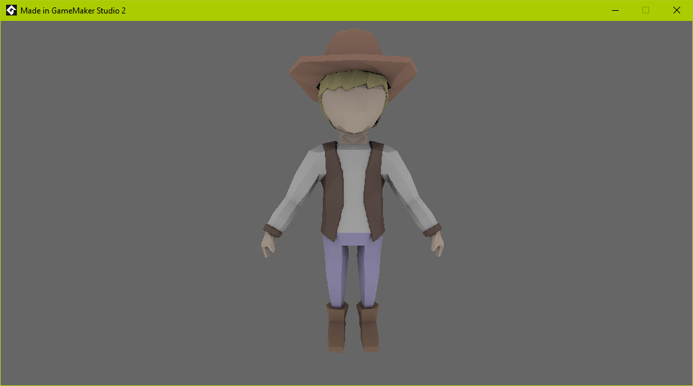

# Collada-Import-For-GMS-2
*.dae (Collada) importer for game maker studio 2

***WARNING THIS LOADER DOESN'T CLEAN UP ANYTHING YET! USE AT YOUR OWN RISK!***

**Example**


Usage:
 0) Add it somewhere
 ```#macro MatrixIdentity matrix_set(matrix_world, matrix_build_identity());```
 
 1) Import Collada scripts from ColladaLoader folder
 2) Go to your object that will hold model and add this
 
 ```
 model = ColladaLoad("model", false);
 fSize = 100;
 ```
 
 This will load "model.dae" realative to the exe
 false - is for animations which aren't working yet
 
 3) In object's draw event add:
 ```
 shader_set(shRenderColladaModel);
    //matrix_add_scale(fSize, fSize, fSize); // This can be also imported from this project
    // instead you can use matrix_set(matrix_world, matrix_build(0, 0, 0, 0, 0, 0, fSize, fSize, fSize));
    // Where fSize is value, i use 100
        // Load texture for model
        // model[1] - list of textures with following struct:
        var a = ds_list_find_value(model[1], 0); // [type, id]
        // Type:
        //    2 - surface
        // other - sprite
        
        // model[0] - final vertex buffer for loaded model with auto generated format
        var t = (a[0] == 2) ? surface_get_texture(a[1]) : sprite_get_texture(a[1], 0);
        vertex_submit(model[0], pr_trianglelist, t);
    MatrixIdentity; // Reset world transformations
shader_reset();
 ```

To enable debug messages replace false with true in following macro

```#macro ColladaShowMessages false```
 
***
**P.S. Whanna work with animations? Add this thing somewhere:**

```
#macro GetMaxWeightsSize 3
#macro GetMaxWeightsFormat vertex_type_float3
```
* You can change 3 and float3 to max number of joints that will affect vertecies
* Don't forget to do same thing in vertex shader of ```shRenderColladaModel```
* #define MAX_JOINTS 3

**Next:**

Uncomment this in vertex shader:
```
GETFORMAT(MAX_JOINTS) Indices : TEXCOORD1;
GETFORMAT(MAX_JOINTS) Weights : TEXCOORD2;
```
and this:
```
    float4 TotalPos = 0.;
    
    for( int i = 0; i < MAX_JOINTS; i++ ) {
        TotalPos += mul(_Transforms[int(In.Indices[i])], In.Position) * In.Weights[i];
        
        // Same for normals
    }
```
Replace ```In.Position``` in ```Out.Position = mul(gm_Matrices[MATRIX_WORLD_VIEW_PROJECTION], In.Position);```
with ```TotalPos```
Enable animations in model loading:
```ColladaLoad(model filename, true);```
Add animation timer
```fAnimTime = 0; // Required for animations```
Add ```ColladaAnimation(model, is loop animation)```
to draw event after ```shader_set(shader id);```

***And have fun playing with ColladaAnimation script :P***


***
